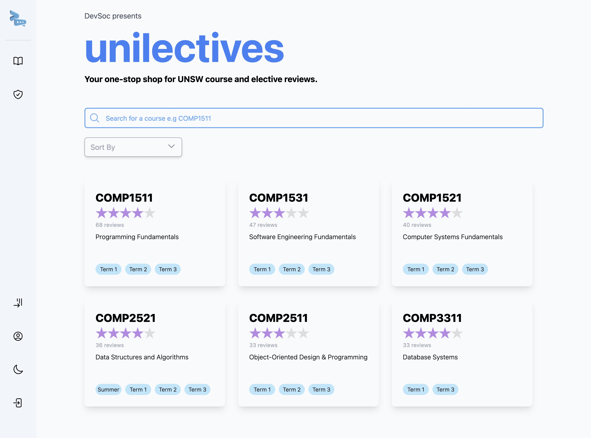

# DevSoc frontend tech assessment

Hey DevSoc team! 👋🏽 That was a fun assessment :) My name is Jordan, I'm a first year post-grad studying Master of IT.

Here is a screenshot of my version of the unilectives homepage:

## Installation

You should be able to clone this repo with no worries.

The actual project directory is under the `frontend` directory called `devsoc-frontend`.

The usual `npm i` and `npm run dev` should work too!

If there are any issues, please contact me on discord: `jordansbenjamin` or my email `jordansbenjamin@gmail.com`

❤️
